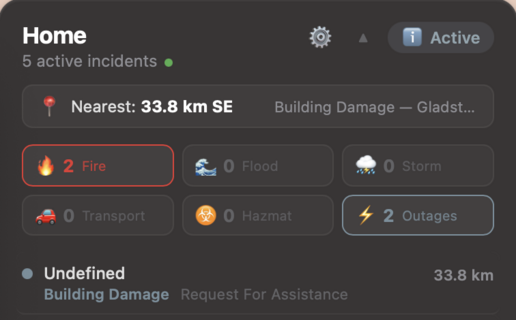

# VicEmergency Desktop Widget for Übersicht

Victorian emergency incidents in Australia on your macOS desktop with live map, warning levels, and category breakdown.

Fetches directly from the official [VicEmergency](https://emergency.vic.gov.au) GeoJSON feed — no Home Assistant or other server required.



---

## Features

- **Live incident tracking** — fires, floods, storms, transport, hazmat, outages within a configurable radius
- **Interactive Leaflet map** — dark or daylight CARTO tiles, clickable incident markers with popups, dashed watch zone ring
- **Australian Warning System** — tracks Advice, Watch & Act, and Emergency Warning levels with colour-coded badges
- **6 category groups** — Fire, Flood, Storm, Transport, Hazmat, Outages with emoji chips and counts
- **Nearest incident** — distance and compass bearing updated every 2 minutes
- **Click-to-pan** — tap an incident row to zoom the map to it, tap again to zoom back out
- **Auto-collapse** — compact banner when all clear, expands automatically when incidents appear
- **In-widget settings** — gear icon opens a config panel; click the map to pick your home location
- **Footer links** — VicEmergency website and ABC 774 radio open in your browser
- **Feed health indicator** — green dot in the banner confirms the feed is responding
- **Three-tier feed fallback** — GeoJSON → JSON → XML with automatic recovery
- **Persistent config** — settings saved to `~/.vicemergency-config.json`, survives widget reloads

---

## Installation

### Quick Install

1. Install [Übersicht](https://tracesof.net/uebersicht/) (or `brew install --cask ubersicht`)
2. Launch Übersicht
3. Download `vicemergency.widget.zip` from the [latest release](https://github.com/customwebsite/ubersicht-vicemergency-widget/releases/latest)
4. Double-click the zip — Übersicht auto-installs `.widget` bundles
5. Click the ⚙️ gear icon on the widget to set your location

### Manual Install

```bash
cp vicemergency.jsx ~/Library/Application\ Support/Übersicht/widgets/
```

### Set Your Location

Click ⚙️ on the widget → click the map to drop a pin → hit **Save**. Or edit `~/.vicemergency-config.json` directly:

```json
{
  "HOME_LAT": -37.40,
  "HOME_LON": 144.59,
  "RADIUS_KM": 50,
  "ZONE_NAME": "Home"
}
```

---

## Configuration

All settings are accessible via the ⚙️ gear icon or the config file at `~/.vicemergency-config.json`.

| Setting | Default | Description |
|---|---|---|
| `HOME_LAT` / `HOME_LON` | `-37.40` / `144.59` | Your location (click the map to set) |
| `RADIUS_KM` | `50` | Monitoring radius in kilometres |
| `ZONE_NAME` | `"Home"` | Title displayed on the widget |
| `MAX_INCIDENTS` | `8` | Maximum incidents shown in list |
| `EXCLUDE_BURN_AREA` | `true` | Filter out historical burn boundaries |
| `SHOW_MAP` | `"auto"` | `"auto"` (when incidents), `true` (always), `false` (never) |
| `MAP_HEIGHT` | `260` | Map height in pixels |
| `MAP_ZOOM` | `10` | Default zoom level |
| `MAP_THEME` | `"light"` | `"light"` (CARTO Voyager) or `"dark"` (CARTO Dark Matter) |
| `HIDE_WHEN_CLEAR` | `false` | `true` hides the widget entirely when no incidents |

Widget position is set in the `.jsx` file:

```js
const WIDGET_POSITION = { top: "20px", right: "20px" };
```

---

## Usage

**When all clear** — the widget shows a compact banner: zone name, "No active incidents", green feed dot, and ✅ All Clear badge. The ▲/▼ toggle lets you manually expand if you want to see the empty chips.

**When incidents exist** — auto-expands to show nearest incident bar, category chips with counts, incident list sorted by distance, and the interactive map. Tap an incident to zoom the map to it. Tap it again (or click the zone name) to zoom back out.

**Settings** — click the ⚙️ gear icon. The map appears with a crosshair cursor — click to drop a pin and auto-fill lat/lon. Save writes to `~/.vicemergency-config.json` and takes effect on the next refresh cycle (2 minutes) or immediately via Übersicht → Refresh All Widgets.

**Foreground / Background** — use Übersicht's built-in interaction shortcut (Preferences → Interaction Shortcut) to toggle between interactive foreground (clickable map, links work) and background mode (click-through to desktop).

---

## ⚠️ Important Safety Notice

**This widget is an informational tool only.** It is not a replacement for official emergency warnings and should never be relied upon as your sole source of emergency information.

During an emergency, always:

- Visit **[emergency.vic.gov.au](https://emergency.vic.gov.au)** for official warnings and updates
- Tune in to **ABC Melbourne 774 AM** for emergency broadcasts ([listen live](https://www.abc.net.au/listen/live/melbourne))
- Call **000** for life-threatening emergencies
- Call the **VicEmergency Hotline** on **1800 226 226**
- Monitor the **VicEmergency app** on your mobile device
- Follow instructions from emergency services personnel

Data feeds may be delayed, incomplete, or unavailable during major events. Always verify critical information through official channels before making safety decisions.

---

## Data Source

Fetches from `emergency.vic.gov.au/public/osom-geojson.json`, published by Emergency Management Victoria. The feed aggregates incidents from CFA, VICSES, BOM, Parks Victoria, VicRoads, ESTA, Melbourne Water, DEECA (formerly DELWP), FRV, and Ambulance Victoria.

### Fallback Chain

If the primary GeoJSON endpoint fails:

1. **Primary:** `emergency.vic.gov.au/public/osom-geojson.json` (full geometry, CAP warnings)
2. **Fallback JSON:** `data.emergency.vic.gov.au/Show?pageId=getIncidentJSON` (flat lat/lon, incidents only)
3. **Fallback XML:** `data.emergency.vic.gov.au/Show?pageId=getIncidentXML` (flat lat/lon, incidents only)

The feed status dot in the banner indicates the active source: green for primary GeoJSON, amber for a fallback endpoint, red on total failure. Fallback feeds have reduced data (no warning polygons, no CAP event types) but still provide incident locations and categories.

### Category Groups

| Group | Example incident types |
|---|---|
| 🔥 Fire | Bushfire, Planned Burn, Burn Area, Burn Advice |
| 🌊 Flood | Flood, Riverine Flood, Flash Flood, Coastal Flood, Dam Failure |
| ⛈️ Storm & Weather | Storm, Severe Storm, Severe Thunderstorm, Damaging Winds, Earthquake, Tsunami |
| 🚗 Transport | Vehicle/Aircraft/Rail/Marine Accident, Rescue |
| ☣️ Hazmat & Health | Hazardous Material, Medical, Shark Sighting, Water Pollution |
| ⚡ Outages & Closures | Power/Gas/Water Outage, Road Closed, School/Beach/Park Closure |

### References

- [EMV Emergency Data & Licence Terms](https://www.emv.vic.gov.au/responsibilities/victorias-warning-system/emergency-data)
- [VicEmergency Data Feed FAQ](https://support.emergency.vic.gov.au/hc/en-gb/articles/235717508-How-do-I-access-the-VicEmergency-data-feed)
- [CFA RSS Feeds](https://www.cfa.vic.gov.au/rss-feeds)
- [Bureau of Meteorology Fire Weather Services](http://www.bom.gov.au/weather-services/fire-weather-centre/index.shtml)

---

## Platform

**macOS only.** [Übersicht](https://tracesof.net/uebersicht/) is a macOS-specific desktop widget engine using the native WebKit renderer. It is not available for Windows or Linux.

For Windows users, similar functionality could be achieved by packaging this widget as an [Electron](https://www.electronjs.org/) or [Tauri](https://tauri.app/) desktop app — the core logic (Leaflet map, feed parsers, fallback chain) is standard HTML/CSS/JS and would carry over with minimal changes.

---

## Related

- [vicemergency-ha](https://github.com/customwebsite/vicemergency-ha) — Home Assistant integration with Lovelace card and map
- [homeassistant-4-day-forecast](https://github.com/customwebsite/homeassistant-4-day-forecast) — CFA Fire Danger Forecast for Home Assistant

---

## License

MIT License — see [LICENSE](LICENSE) for details.

Data sourced from the State of Victoria under [Creative Commons Attribution 3.0 Australia](https://creativecommons.org/licenses/by/3.0/au/).
